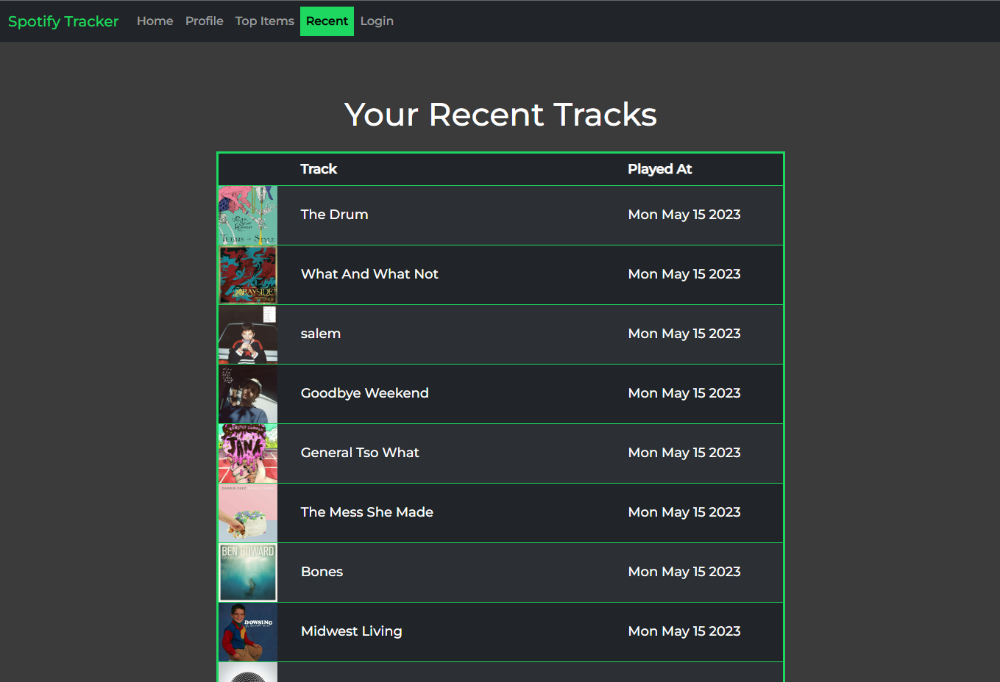

# SpotifyTracker

This is a basic demonstration of utilizing the Spotify API using Angular and Node/Express with full mobile compatibility.

## Features

- View a list of your recently played songs
- View your top Artists and Tracks varying from short-term, medium-term, and long-term
- View track recomendations based on your top tracks

## Planned for the future

- Enhanced Playlist Creator/Editor
- Playlists creation based on song reccomendations

